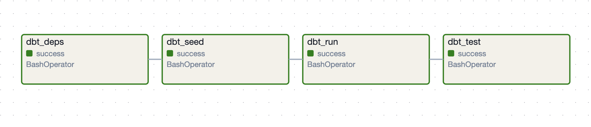

# Orchestration: dbt & Airflow

This project provides a setup for orchestrating data workflows locally with **dbt** and **Apache Airflow**, all containerized and managed through **Docker** (docker-compose.yaml + Dockerfile).

## Motivation
- **Simplify the setup** for local data orchestration using dbt and Airflow.
- **Provide a learning platform** for data engineers and analysts to explore how dbt and Airflow work together to build robust data pipelines.
- **Bridge the gap** between local development and cloud deployments.
- **Containerized Setup** and easily reproducible environment using Docker Compose for Airflow, dbt, and other required services.

## Prerequisites
- **GCP Account** id required for accessing and managing tables and cloud resources.
- **IAM Roles for Service Account** ensure the service account has the following roles:
  - **BigQuery Admin**
  - **Storage Admin** (if external tables are used)

### Setup
1. Clone the repository: `git clone https://github.com/AnzelaMachackova/orchestration-dbt-airflow.git`

2. Build the Docker containers: `docker compose build`

3. Start the environment: `docker compose up -d`

4. To stop the environment: `docker compose down`

5. Access the Airflow UI:
   - URL: [http://localhost:8080/](http://localhost:8080/)
   - Default credentials:
     - Username: `airflow`
     - Password: `airflow`

## Description

This DAG runs a sequence of dbt commands for a data pipeline:
- Install Dependencies: `dbt deps`
- Seed Data: `dbt seed`
- Run Models: `dbt run`
- Test Models: `dbt test`

